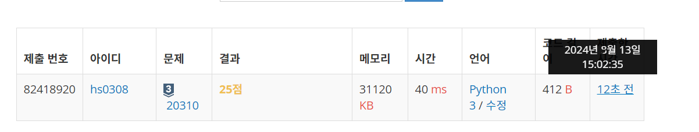

### 20310번 타노스
0과 1 모두 짝수 
S = 000011110011 (length : 12)
S'= 001101 (length: 6)
S = 00111100 (length : 8)
S'= 0110 (length : 4)
S' 로 가능한 문자열 중 사전순으로 가장 빠른 것 
000111
사전순으로 빠르려면 0이 앞에 와야겠지
조건 ) 
- S 의 길이는 4의 배수이다.
- S 의 홀수 번째 문자는 1, 짝수 번째 문자는 0

대충 위에 적은 대로면, 
S 의 길이 /2 = S' (당연함 반절임)

해결 방법:

if ) S의 길이가 4의 배수라면 진행

S에서 0과 1의 개수를 센다
0의개수/2+ 1의개수/2 = S'의 길이니까
return 할때에는
S'의 0 개수만큼 먼저 출력 + 1 출력
이거 근데 문자열을 만들어야대자나...

else )
예외처리

해볼까

25점...! 나머지 75점은 어디갔지? ㅋㅋㅋㅋㅋㅋㅋㅋㅋㅋ

아 이게 내가 제한이랑 서브태스크를 잘못읽음
서브 태스크 조건을 제대로 충족 안시킨듯 
-> S 의 홀수번째 문자는 1, 짝수번째 문자는 0이다..

서브태스크 조건을 충족하지 않아도 실행이 되어야 함
으잉 여전히 25점임
우쒸 

---

### 