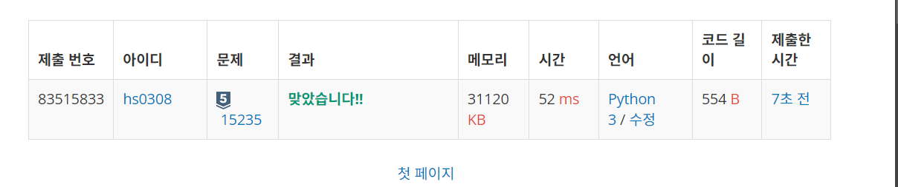
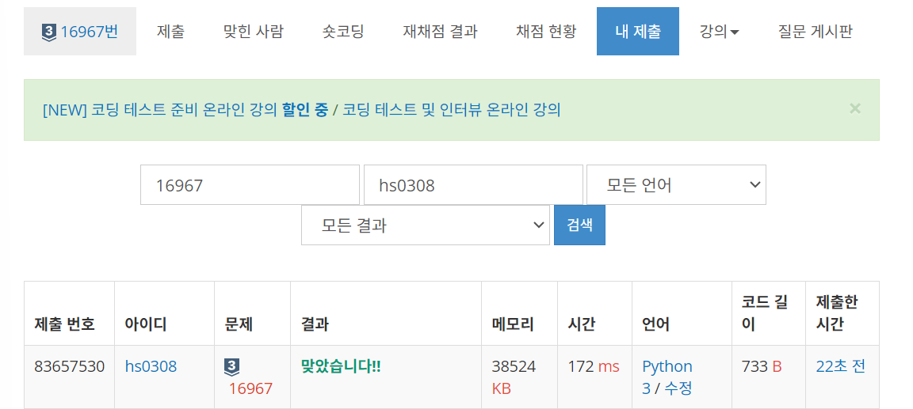
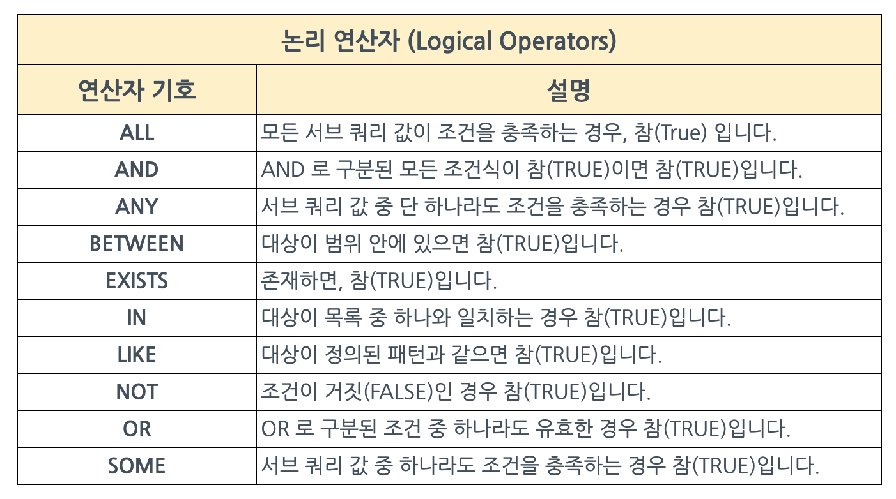

### 9월 첫주차
https://www.acmicpc.net/problem/10021 - g3 
https://www.acmicpc.net/problem/17780 - g2 
https://www.acmicpc.net/problem/17837 - g2 
https://www.acmicpc.net/problem/16967 - s3 
https://www.acmicpc.net/problem/15235 - s5 

  
15235

  어우 영어 울렁증 스껄~
  input)
  - N, 참가자의 수 
  - N개의 정수 (각 참가자에게 먹일 피자 조각 수)
  - 최소 1조각, 최대 100조각
  - 피자 줄 때마다 1초

  output)
  - 각 참가자가 필요한 모든 조각을 얻는 시간

  4
  1 3 1 4
  받는 순서 :
  1,2,3,4,2,4,2,4,4
  시간 : 
  1,2,3,4,5,6,7,8,9

  1 7 3 9

  **문제 풀이)**
  (1,1)
  (2,3)
  (3,1)
  (4,4)
  요렇게 input 배열을 담아두고..
  반복문 돌면서 
  key 의 value 를 보고
  만약 value >= 1 이라면
  value -1 을 한 다음에 
  시간 +=1

  만약 value ==1 이라면
  시간 +=1 한 다음에 
  현재 시간을 출력용 배열[key-1] 에 담고
  value -1을 한 다음에
  넘어가유 

  만약 value ==0 이라면
  바로 다음 배열 인자를 확인한다.
  continue 

  마지막으로, 반복문 다 돌고 나면
  return 을 출력배열을 하면 될듯 하다. 

  요런식으로 .. 하면 되려나?

  근데 의문점)
  반복문을 어떻게 끝낼 수 있을까?
  -> while any 라는 개념을 썼다. 
  파이썬 내장함수 중 any()와 all()이 있다. 둘은 아큐먼트로 iterable한 객체를 받는데 이 객체를 돌면서 조건을 검사해 답을 True/False의 답을 반환한다.

  any() : 하나라도 True인게 있으면 True
  all() : 모두 True여야 True 반환
  쉽게 생각해 any는 or, all은 and 연산이라 보면 된다.

  그냥 while True 해버리기엔 조건이 필요했기 때문에,,
  새롭게 알고간다.

  

  
16967

  뭔소리야...
  
  H x w 인 배열 A 와 두 정수 X,Y 
  
  크기가 (H+X) x (W+Y) 인 배열 B 는 
  
  배열 A 와 배열 A 를 아래로 X칸, 오른쪽으로 Y 칸 이동시킨 배열을 겹쳐 만들수있다.
  
  배열 B 가만든다고? 먼소리야

  그니까 B  == (H-X) x (W-Y) (A 배열이 이동한 값)
  
  B 배열의 값은 최종적으로 A 배열을 이동한 값과 합쳐or 안합쳐진 값인것같음
  이 소리인것같은디?
  

  H W X Y
  
  2 4 1 1

  2행 4열의 크기를 가진 A 
  
  H+X = 3 이니까 3줄, W+Y = 5니까 5열 (3행 5열)
  
  B 의 배열 입력 
  
  1 2 3 4 0
  
  5 7 9 11 4
  
  0 5 6 7 8
  
  B 는 n x n 배열
  

  B[i][j] 가 두 배열 모두에 포함되지 않으면 0이기 때문에
  
  B[0][4] 가 두 배열 모두에 포함되지 않는다 즉, (0,4) 가 A 에없다고?
  
  B[2][1] 가 두 배열에 모두에 포함되면 0 이외의 값
  
  ex ) 
  
  B[2][1] = 5이기 때문에,,, 이게 A[2][1] + A[1][0] = 5 
  일수도잇고,,
  
  B[2][1] = 5 가 두 배열 중 하나에 포함되면 B[2][1] = A[2][1] or A[1][0]
  
  이다..?

  으음..
  
  B[2][0] = 0 => (2,0) 이 A 에 없다. 그렇다는 소리는,, A의
  A[2][*] 요 행은 다 없고, 이동한 값만 존재한다는소리아닐까?
  

  B[2][1] = A[1][0] = 5 
  
  B[2][2] = A[1][1] = 6
  
  B[2][3] = A[1][2] = 7
  
  B[2][4] = A[1][3] = 8
  

  그러면 
  
  B[0][4] 역시도 (0,4) 가 A 에 없으니까.. A를 이동한 값은 존재한다는 소리인가
  

  약간 답만보고 유추를 해보자. 머리터질것가트니깐.
  
  1 2 3 4
  
  5 6 7 8 
  

  1 2 3 4 0
  
  5 6+1 7+2 8+3 4
  
  0 5 6 7 8
  
  오른쪽으로 한칸 아래로 한칸
  내가 너무 어렵게 생각했다..
  다른 예제를 보고 더 생각해보자

  H W X Y
  
  3 3 2 1
  
  A : 3 행 3열
  
  오른쪽으로 1칸, 아래로 두칸움직임

  1 2 3 0
  
  4 5 6 0
  
  7 9 11 3
  
  0 4 5 6
  
  0 7 8 9
  
  A[2][1] 부터 겹치게 된다. 그렇다는 소리는? 그 전까지는 안겹친다는 것
  
  A[0][0] = B[0][0] = 1
  
  그 논리로 A 가
  
  1 2 3 
  
  4 5 6
  
  7 ? ? 로 구성됨을 알 수 있다.
  
  그럼 우리가 알아야 하는건 A[2][1], A[2][2] 만 알면 A 출력가능

  B[2][1] = A[2][1] +A[0][0] = 9 니까, A[2][1] = 8
  
  B[2][2] = A[2][2] +A[0][1] = 11이니까, A[2][2] = 9

  즉 남은 2개의 숫자는 8과 9이다.
  
  A 는 
  
  1 2 3
  
  4 5 6
  
  7 8 9

  이걸 코드로 만들어보면 되는데 응..

  저기서 A[2][0] 까지는 했다 쳐, 근데 남은 개수가 몇개인지 어케알지?
  
  음.. 아 0인 것을 확인해서 할까? 아니야..
  A[2][1] ~ A[H-1][W-1] 을 알기 위해서는
  B[i][j] = A[i][j] + A[i-X][j-Y] 이기 때문에
  A[i][j] = B[i][j] - A[i-X][j-Y] 이다.
  ㅇㅋ 확인 
  
  느이아아아악! 거의 한시간 넘게..풀었는데!! 풀었어!! 이야각악!
  
  

  
17780

  크기가 : N x N  
  말의 개수 : K 개  
  하나의 말 위에 다른 말 올릴 수 있어 
  체스판 색 : 흰,빨,파  
  방향 : 위, 아래, 왼, 오가 이미 정해져있다.  
  턴 한번 - 1~K 말 까지 순서대로 이동,
  말 하나 이동할 때 위에 올려진 말도 함께 이동,
  가장 아래에 있는 말만 이동,
  말이 4개 쌓이는 순간 게임 끝  

  - A번 말이 이동하려는 칸이
    - if ) 흰색이면 -> 이동
      - if ) 말이 이미 존재하면 가장 위에 A 번 말을 올려놓
      - A,B,C 로 쌓여있고 D,E 가 있는 경우 D,E,A,B,C 순서로 쌓임 (스택?)
    - elif ) 빨간색 -> 이동 후 A 번 말과 그 위에 있는 모든 말의 쌓이 순서를 반대로 바꿈
        - if ) 말 존재 x
          - A,B,C 이동 후 C,B,A 로 순서 변경
        - else)
          - A,D,F,G 이동 후 E,C,B 가 있다면 E,C,B,G,F,D,A 로 쌓임
    - elif) 파란색 -> A 의 이동 방향을 반대로, 한칸 이동
      - if ) 이동하는 칸이 파란색이라면, 방향만 바꾸고 이동x

    - all) 체스판 벗어나려는 경우
      - 방향만 바꾸고 이동 x

  개 어질어질하네 

  1,2,3,4 로 되어있으면 그 순서는 처음에만 숫자대로 가는듯 
  그 다음부터는 제일 밑에있는것부터 진행 -> 그 다음 위에 있는 거  

  N,K 
  0 : 흰색, 1: 빨간색, 2: 파란색  
  말의 정보는 행,열의 번호, 이동방향 
  이동방향 : 1,2,3,4 (오 왼 위 아래) 
  벌써 하기싫어 이야 써야하는 if 문이 아득하네 
  출력: 게임이 종료되는 턴의 번호 /  종료 조건 : 말이 4개 쌓이는 순간, / 만약 쌓이는 순간이 영영 없거나 턴이 1000이 넘어가면 종료 후 -1 출력 

  어 어렵다. 
  말의 정보를 K[0] = 하고 행,열,방향 담아두는건가? 
  그럼 이제 이동하고 부터의 순서는 큐나 스택에 담아두는건가? 
  ㅇ.. 어떻게 순서를 바꾸지? 배고파서 머리 안돌아감 

  같은 칸에 말이 여러개 있는지 , 그 순서를 어떻게 알고 정하지  
  
  

  

  

  
10021

  <!-- 내용 -->

  
 (프로그래머스)SELECT : 평균 일일 대여 요금 구하기

  느아아 sql 다 까먹었네...

  - 함수 : ROUND("값", "자리수")

  #### ROUND
  소수점 반올림 - (소수점 첫째자리 반올림의 경우)
  SELECT ROUND(1235.543)    --①
       , ROUND(1235.443)    --②
       , ROUND(1235.443, 0) --③
    FROM dual

  ①,②,③ 모두 소수점 첫번째 자리수를 반올림 한다. ①은 소수점 첫번째 자리수가 5이므로 반올림 되었고, ②는 4이므로 그냥 버려졌다. ③은 ①,②와 동일하게 소수점 첫번째 자리수를 반올림하는 것이며 두번째 파라미터(0)은 생략이 가능하다.

  ### 논리 연산자
  

  이외에 참고 하면 좋은 [링크](https://velog.io/@seanlee/%EB%A7%88%EC%BC%80%ED%84%B0%EB%A5%BC-%EC%9C%84%ED%95%9C-SQL-WHERE-%EC%A0%88%EC%9D%84-%ED%86%B5%ED%95%9C-%EC%A1%B0%EA%B1%B4%EB%B6%80-%EC%BF%BC%EB%A6%AC)

