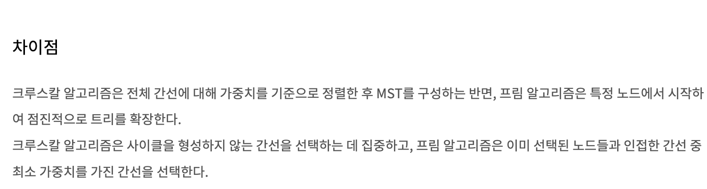
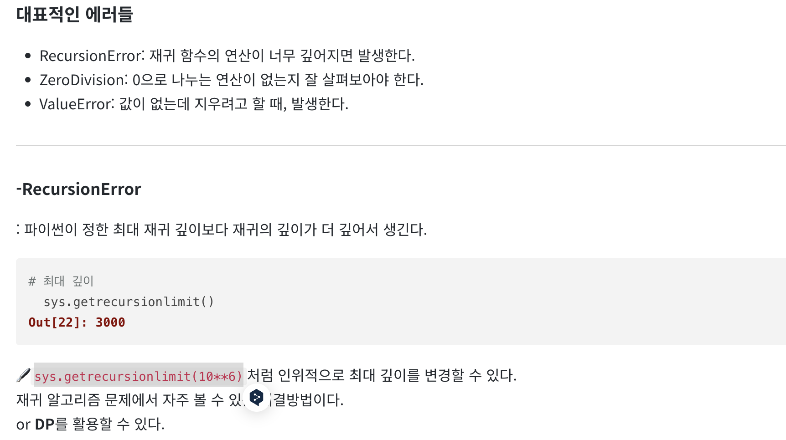
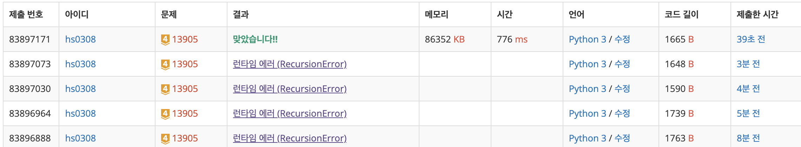

https://www.acmicpc.net/problem/1806 - 부분합 G4
https://www.acmicpc.net/problem/2179 - 비슷한 단어 G4
https://www.acmicpc.net/problem/17135 - 캐슬디펜스 G3
https://www.acmicpc.net/problem/13905 - 세부 G4
https://www.acmicpc.net/problem/11568 - 민균's 계략 S2

SQL)
SUM - https://school.programmers.co.kr/learn/courses/30/lessons/131697

### SUM,MIN,MAX

---

<details>
  <summary>131797 </summary>
  
  ```
  SELECT MAX(PRICE) as 'MAX_PRICE' FROM PRODUCT
  ```
</details>


<details>
  <summary> 59406 </summary>
  ```
  -- 코드를 입력하세요
  SELECT COUNT(ANIMAL_ID) as 'count' FROM ANIMAL_INS
  ```

</details>

<details>
  <summary>293261</summary>

  개수세는건 COUNT

  - 293261

  물고기 종류 별로 가장 큰 물고기의 ID, 물고기 이름, 길이를 출력하는 SQL 문을 작성해주세요.

  물고기의 ID 컬럼명은 ID, 이름 컬럼명은 FISH_NAME, 길이 컬럼명은 LENGTH로 해주세요.
  결과는 물고기의 ID에 대해 오름차순 정렬해주세요.
  단, 물고기 종류별 가장 큰 물고기는 1마리만 있으며 10cm 이하의 물고기가 가장 큰 경우는 없습니다.

  다까먹었네
  오름차순 정리 -> ? 오더바이였나

  글구 조인 해야함 type 으로 이름 찾아야해서.. 

  내생각엔 개념한번 싹 보고 문제푸는게 훨 나을듯
  데베설 자료 가져와잇!
</details>

---
## 알고리즘 ( 백준 )

<details>
  <summary>민균이의 계략 11568</summary>
  - 증가하는 순서의 배열이 아니면 놀림받는대. 너무함
  - 카드가 5개면, 최대한 많은 원소의 개수를 가진 카드 배열을 제시해야함.

  테스트 케이스를 보며 이해해보자.<br>
  1,2,8,9,10 은 왜 안되지? 아 알겠다.
  이 순서를 바꿀 수는 없는것 같다. <br>
  예컨대 배열이 8 9 1 2 10 이면
  1 2 10이 되고, 8,9,10 은 되는데 1,2,8은 안된다. 왜냐면 8이 좀 더 앞순서에 제시되었으니까! <br>

  그리디 비스무리 한건가..?
  <br>
  
  **문제 풀이**

  - 반복문을 돌면서 원소 다음값이 크다면 원소의 개수 +1
  - 만약 작다면 반복문 종료, 다음원소부터 다시 반복문 돌기,
    - 이때 두번째 반복문과 이전에 돌았던 값의 answer 를 비교해본다. 더 큰값을 answer 로 넣어준다.
  
  - 지금 위 상황에 오류가 있다. 지금은 그냥 그 다음 원소가 큰지만 확인해서.. 잘못됨. 
  - 예컨대 8 > 9> 면 9보다 큰게 있는지를 찾아야함 
  그것도 추가해주자.
  <br>
  <br>
  <br>

  ```
  import sys
  N = int(sys.stdin.readline())
  card = list(map(int, sys.stdin.readline().split()))

  answer =0
  for i in range(0,N):
      compare_num = card[i]
      num =1
      for j in range(i+1,N):
          if compare_num < card[j]:
              num +=1

      answer = max(answer,num)

  print(answer)
```
이렇게 했는데 틀렸댄다. dp 를 하랜다.
이게 LIS(최장증가수열 알고리즘)이라고한다.


### LIS?
LIS 알고리즘 (Longest Increasing Subsequence Algorithm) 은 최장증가수열 알고리즘으로 증가하는 원소들의 가장 긴 부분집합을 찾는 알고리즘이다. <br>
<br>
[링크](<https://gom20.tistory.com/91#:~:text=LIS%20%EC%95%8C%EA%B3%A0%EB%A6%AC%EC%A6%98%20(Longest%20Increasing%20Subsequence,%EC%A7%91%ED%95%A9%EC%9D%84%20%EC%B0%BE%EB%8A%94%20%EC%95%8C%EA%B3%A0%EB%A6%AC%EC%A6%98%EC%9D%B4%EB%8B%A4.>)보고 이해하기

  
</details>


<details>
  <summary>13905</summary>

  - 최대한의 금빼빼로 개수
  - 금빼빼로 하나무게는 1
  - 집의수 : N
  - 다리의 수 : M
  - 숭이 출발 위치 : s
  - 혜빈이 위치 :e

  - 이게!! MST 비스무리한 문제같은데!??!

 board[][] <br>
 watering fields <br>
 제일 작은 비용으로 물주기 <br>
 제일 작은 비용으로 다 이어보기 <br>

  1. sort
  2. 먹기
  3. union 뱉기
  4. count세기

  <br>
  일단 이 문제는 그래프다.
  최대의 값을 찾는거라서 완전한 mst 는 아닌듯?<br>
  근데이제 연결리스트같은걸로 해야할것같음. <br>
  
  집1 집2 무게
  1 - 2 - 2 <br>
  1 - 7 - 4 <br>
  2 - 3 - 5 <br>
  3 - 7 - 5 <br> 
  4 - 6 - 1 <br>
  6 - 7 - 4 <br>
  5 - 6 - 3 <br>
  5 - 7 - 1 <br>
  3 - 5 - 2 <br>

  일단 나는 크루스칼 자체를 구현하는걸 잘 몰라서 공부해서 푸는 방법을 좀 외워보겠다.
  구현하다 보니 의문점이 들었다. 특정 정점에서 시작하는건 어떻게 하지?
  검색을 해보니 그런 점에서는 프림이조금 더 낫다고 하는데
  

  <br>
  이게.. 재귀 오류가 생긴다. 이렇게 밖에 해결못하나 싶긴 한데 검색해서 찾았다.
  

  정답 ~ 이번 문제는 거의 공부를 위해 푼거라 다음번에 좀 더 외워서 풀어봐야겠다. 
  

  <br>
  제일 마니 도움된 블로그 : https://deepdata.tistory.com/800

  ## 크루스칼, 프림, 신장트리
  1. 신장트리 : 그래프 내의 모든 정점을 포함하는 트리 
  - 모든 정점이 연결되어있어야 하고, 사이클 포함해서는 안됨
    - n개의 정점을 정확히 n-1 개의 간선으로 연결 
  - dfs, bfs 를 사용해서 신장트리 찾을수 있음 
  - 하나의 그래프에는 많은 신장트리가 존재할 수 있음 

  2. 최소 신장 트리
  : 신창 트리중 사용된 간선들의 가중치 합이 최소인 트리

  - 간선 가중치를 고려
  - 간선 가중치 합이 최소
  - 신장트리의 특징과 같은 특징 공유

  3. mst 구현방법 : 두 알고리즘은 그리디 일종이래
  1) 크루스칼 알고리즘 
    - 간선중심 알고리즘
    - 모든 간선을 가중치 기준으로 오름차순 정렬하고, 이 간선들을 순서대로 모든 정점이 연결될 때까지 연결하는 알고리즘
    - union-find 알고리즘을 이용해 구현가능

  [동작방식]
  - 그래프의 간선들을 가중치 기준 오름차순으로 정렬한다.
  - 정렬된 간선 리스트들을 순서대로 선택하여 간선의 정점들을 연결한다.
    - 이 때 정점을 연결하는 것은 Union-Find의 Union으로 구현한다.
  - 만약 간선의 두 정점 a, b가 이미 연결되어 있다면 연결하지 않고 넘어간다.
  - 위의 과정을 반복해 최소 비용의 간선들만 이용해 모든 정점이 연결된다.


  2) 프림 알고리즘
  -  정점 중심 알고리즘 
  - 임의의 시작점에서 현재까지 연결된 정점들로부터, 연결되지 않은 정점들에 대해 가장 가중치가 작은 정점을 연결하는 알고리즘
  - 트리 집합을 단계적으로 확장하는 것이 핵심
  - Priority Queue를 이용한 최소 힙으로 구현 가능
  - 간선들을 최소 힙에 추가하는 것은 최대 E번, 최소 힙에 최대 V개의 정점들이 들어오기 때문에 추가된 정점의 가중치를 최소 힙 내부에서 정렬하는 것은 최대 logV만큼 수행.
    - 따라서 모든 간선 (E) * 간선을 통해 삽입된 정점의 가중치 정렬 (logV) = O(ElogV)  
    - (E : 간선 개수 / V : 정점 개수)
  2-1) 프림 알고리즘 동작 방식
  1. 임의의 정점을 시작점으로 선택해 최소 신장 트리에 추가. 해당 정점과 연결된 모든 간선을 우선순위 큐에 추가
  2. 우선순위 큐에서 비용이 가장 작은 간선을 선택
  3. 해당 간선이 최소 신장 트리에 포함된 두 정점을 연결하는지 아닌지 확인<br>
    - 만약 두 정점이 모두 최소 신장 트리에 있을 경우 연결하지 않고 넘어감.<br>
    - 만약 정점 u는 최소 신장 트리에 포함되어있고, 다른 정점 v는 아닐 경우 해당 간선과 정점 v를 최소 신장 트리에 추가 후, 정점 v와 최소 신장 트리에 포함되지 않는 정점을 연결하는 모든 간선을 우선순위 큐에 추가
  4. 최소 신장 트리에 (정점 개수 - 1)개의 간선이 추가될 때까지 2, 3번 과정을 반복한다.

  3) 크루스칼 알고리즘과 프림 알고리즘 선택 기준 <br>
  간선 개수 = E, 정점 개수 = V 라고 할 때 <br>
  크루스칼 알고리즘의 시간 복잡도 : O(ElogE)<br>
  프림 알고리즘의 시간 복잡도 : O(ElogV)
  따라서 간선이 많을 때는 프림 알고리즘 / 정점이 많을 때는 크루스칼 알고리즘이 유리하다.


</details>
<details>
  <summary>1806</summary>
  N,S<br>
  N : 수열의 길이<br>
  S : 수열의 부분합<br>
  부분 합을 충족하면서 길이가 가장 짧은것을 출력하고, 그런것이 불가능하다면 0을 출력 <br>
  
  예제를 보고 이해해보자. <br>
  5 10 = 15 <br>
  2 3 10 = 15<br>
  1 3 4 7 = 15 <br>
  여튼 부분합이 되는 경우, 넘는 경우는 굉장히 많음
  이걸 어떻게 ?? <br>
  내림차순 정렬? <br>
  10 9 8 ~~~ 하면 되겠네.. 근데 이게 이렇게 쉬운문제라고? 아닐것같은데...<br>

  역시나 틀림. 뭐가 문제일까? (문제는 많을 것같음 내가 생각하지 못한 예외들이랄까나..) <br>
  ```
  import sys
  N,S = map(int,sys.stdin.readline().split())
  Arr = list(map(int,sys.stdin.readline().split()))

  sorted(Arr,reverse=True)
  num = 1
  for i in range(1,N):
      if Arr[i]+Arr[i-1] > S:
          num += 1
          break 

  print(num)

  ```

  일단 위 문제에서 내가 간과한 것은, 길이가 제한이 되어있다는 것이다. (시간 제한이 있음)

  ### 투포인터 알고리즘
  이란다 이게.. <br>
  배열에서 원래 이중 for문으로 O(N^2)에 처리되는 작업을 2개의 포인터의 움직임으로 O(N)에 해결하는 알고리즘이다. <br>

  여기서 포인터는 C언어의 포인터가 아니라 작업을 처리하기 위해 <br>
  생성한 변수이다. 포인터라는 변수를 두개를 선언해서 투 포인터라고 부른다.<br>

  시작점(start)과 끝점(end)이 첫 번째 원소의 인덱스(0)를 가리키도록 한다.<br>
  현재 부분 합이 M과 같다면, 카운트한다.<br>
  현재 부분 합이 M보다 작다면, end를 1 증가시킨다.<br>
  현재 부분 합이 M보다 크거나 같다면, start를 1 증가시킨다.<br>
  모든 경우를 확인할 때 까지 2~4 과정을 반복한다.<br>


</details>
<details>
  <summary>2179</summary>


</details>
<details>
  <summary>17135</summary>


</details>

---