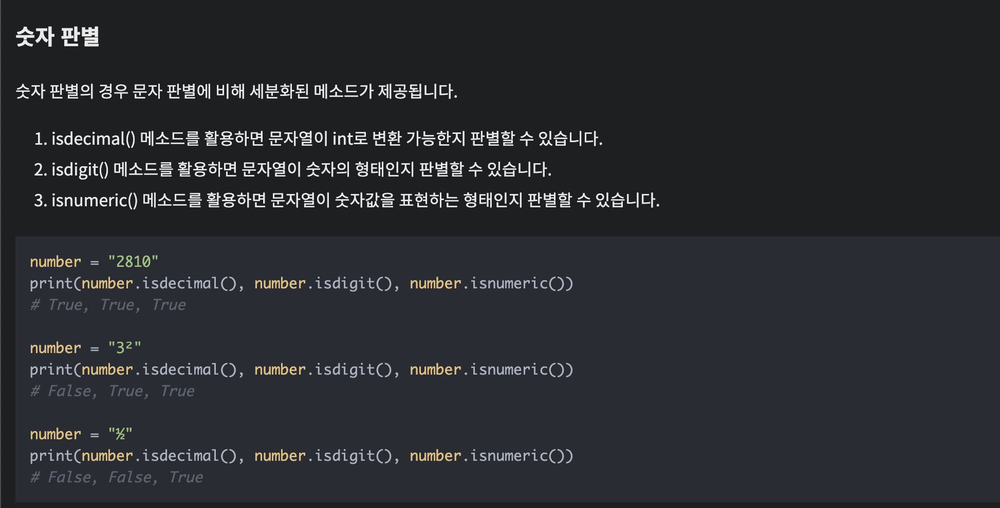
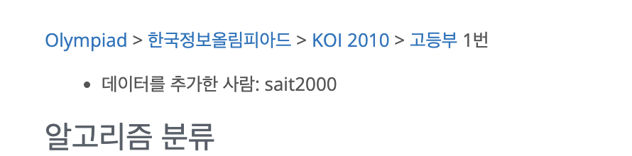

### [ 알고리즘 ]
- https://school.programmers.co.kr/learn/courses/30/lessons/92341 - 주차 요금
- https://school.programmers.co.kr/learn/courses/30/lessons/81302 - 거리두기
- https://school.programmers.co.kr/learn/courses/30/lessons/77485 - 행렬테두리
- https://school.programmers.co.kr/learn/courses/30/lessons/72410 - 이름머시기
- https://school.programmers.co.kr/learn/courses/30/lessons/17686 - 파일명 정렬
- https://www.acmicpc.net/problem/2473 - 세 용액

### [ sql ]
- [보호소에서 중성화한 동물](https://school.programmers.co.kr/learn/courses/30/lessons/59045)
- [상품을 구매한 회원비율 구하기](https://school.programmers.co.kr/learn/courses/30/lessons/131534)
- [특정 옵션이 포함된 자동차 구하기](https://school.programmers.co.kr/learn/courses/30/lessons/157343)
- 루시와 엘라 찾기


## 문제풀이
> 이번에는 sql 제외하고 다 90분 이내로 푸는걸 목표로 했다 (2문제씩), 그랬더니 처참하다. 미치겠다. 돌겠다. 에바다. 0솔 신화를 썼다. 

</details>
<details>
  <summary>보호소 어쩌고 문제</summary>
    이 문제는 테이블 a 랑 b에서 <br>
    SEX_UPON_INTAKE와 SEX_UPON_OUTCOME값이 다르기만하면 된다. <br>
    중성화를 했다가 과거로 되돌아갈수는 없으니까..ㅋㅋㅋㅋ<br>
    


</details>
<details>
  <summary>상품을 구매한 회원 비율 구하기</summary>
    USER_INFO 테이블과 ONLINE_SALE 테이블에서 2021년에 가입한 전체 회원들 중 상품을 구매한 회원수와 상품을 구매한 회원의 비율(=2021년에 가입한 회원 중 상품을 구매한 회원수 / 2021년에 가입한 전체 회원 수)을 년, 월 별로 출력하는 SQL문을 작성해주세요. 상품을 구매한 회원의 비율은 소수점 두번째자리에서 반올림하고, 전체 결과는 년을 기준으로 오름차순 정렬해주시고 년이 같다면 월을 기준으로 오름차순 정렬해주세요.
    이 문제는,,, sql 지식을 요한다. 다까먹었다. <br>
    user info 테이블에서 2021년에 가입한 회원의 숫자, <br>
    online_sale 테이블에서 2021년 N월에 구매한 회원의 숫자(user id 중복 가능한 테이블이라서 중복없이 세야함),<br>
    비율은 소수점 두번째에서 반올림,<br>
    결과는 년, 월을 기준으로 오름차순<br>
    오우 어렵다 생각은 되는데 방법을 모르겠어 역시 레벨 5<br>

    정답은 아래와 같다.
    ```

    SELECT DATE_FORMAT(O.SALES_DATE, '%Y') AS YEAR,
            DATE_FORMAT(O.SALES_DATE, '%m') AS MONTH,
            COUNT(DISTINCT U.USER_ID) AS PUCHASED_USERS,
            ROUND(COUNT(DISTINCT U.USER_ID)/(SELECT COUNT(*) FROM USER_INFO WHERE joined LIKE '2021%'), 1) AS PUCHASED_RATIO
    FROM USER_INFO U
    JOIN ONLINE_SALE O
    ON U.USER_ID = O.USER_ID
    WHERE U.JOINED LIKE '2021%'
    GROUP BY YEAR, MONTH
    ORDER BY YEAR, MONTH
    ;
    직접 생각해서 다시하기 
    ```

    여기서 내가 다시 외워야 할것 : DATE_FORMATE, ROUND, LIKE, 두개 열을 정렬하는법 ...
    생각이 잘 안나.. 특히 ROUND

</details>

<details>
  <summary>특정 옵션이 포함된 자동차 구하기</summary>
  LIKE 썼다.

</details>

<details>
  <summary>루시와 엘라찾기</summary>
    IN 이라는게 있군,,, 있을까? 싶었는데 있었음.
    괜히 WHERE NAME LIKE '%Lucy%' or '%Ella%' or '%Pickle%' or '%Rogan%' or '%Sabrina%' or '%Mitty%'
    사람이 머리가 나쁘면 몸이고생의 표본 

</details>
</details>
<details>
  <summary>자동차 종류별 특정 옵션이 포함된 자동차 수 구하기</summary>
  무난 


</details>
</details>
<details>
  <summary>문제</summary>


</details>


--- 위에까지가 sql


<details>
  <summary>주차요금 계산</summary>
    if ) 기본 시간 이하라면, 기본 요금 청구, <br>
    if ) 기본 시간 초과, 기본 요금 + 초과한 시간에 대해 단위 시간 마다 단위 요금을 청구.<br>
      if ) 나눠 떨어지지 않으면, 올림함<br>
    fees : 주차 요금을 나타내는 정수 배열<br>
    records: 자동차의 입/출차 내역을 나타내는 문자 배열<br>
    - 시각을 기준으로 오름차순 정렬<br>
    - IN만 있고, OUT 이 없으면 23:59출차를 기준으로 함<br>
    return : 차랑번호가 작은 자동차부터 청구 요금을 담아서 리턴<br>

    고민)<br>
    1. 어떻게 records를 나누지?<br>
      - 문자열로 저장된 값을 쪼개서 배열을 만들어야할듯<br>
      근데 할줄을 모름
      - 그 다음에, 05:34 와 같은 시간을 그냥 숫자로 만들어버려잇 <br>
    2. 입출차기록 배열을 보고, 차량 번호별로 누적 시간을 찾고, 그에 따른 요금을 계산해서 저장한다. 근데 이게 한번에 가능한거냐... <br>


</details>
<details>
  <summary>거리두기 확인하기</summary>
  - 맨해튼 거리 : 두 테이블 T1, T2가 행렬 (r1, c1), (r2, c2)에 각각 위치하고 있다면, T1, T2 사이의 맨해튼 거리는 |r1 - r2| + |c1 - c2| 입니다.<br>
  - 맨해튼거리 2 이하로 앉지 못함, 단 파티션으로 막혀있는경우 허용 <br>
  - x 가 파티션임<br>
  - 각 대기실별로 거리두기를 지키고 있으면 1을, 한 명이라도 지키지 않고 있으면 0을 배열에 담아 return<br>

  - 풀어보자<br>
  1. 응시자간의 거리를 구한다.<br>
    - 이때, 이 거리가 맨해튼 거리 2초과라면, ok<br>
    - 만약 이 거리가 맨해튼 거리 2이하라면, 안된다.<br>
      - 근데, 이 응시자 사이에 x 가 존재한다면 ok <br>
      - 여기서 의문점, 응시자 사이에 x 는 어떻게 얼만큼 <br>어느위치에 있어야하는거지.. 모르겠어 모르겠다 <br>몰겠다고......~~~~~~~ 무력한 이느낌~~~~~₩<br>
      모르겠네 모르겠느뇽 오라가짜 모르겠다 모르겠어 왜해야하노
      하기싫다 <br>
      

      ```
      places[0][0][0] = "P" 인거겠지? 
      [["POOOP", 
        "OXXOX", 
        "OPXPX", 
        "OOXOX", 
        "POXXP"], 
      ["POOPX", "OXPXP", "PXXXO", "OXXXO", "OOOPP"], 
      ["PXOPX", "OXOXP", "OXPOX", "OXXOP", "PXPOX"], 
      ["OOOXX", "XOOOX", "OOOXX", "OXOOX", "OOOOO"], 
      ["PXPXP", "XPXPX", "PXPXP", "XPXPX", "PXPXP"]]
      ```
</details>
<details>
  <summary>행렬 테두리 회전하기</summary>

  - 문제는 이해함. 근데이제 이걸 어떻게 구현하는냐...막막하다..
  - 뭔가 식을 세우게 되는데 이거 dp 인가.. 
  - 아니면 그 이분탐색 비스무리 그런건가 몰?루

  - 일단 row x columns 로 이루어진 1씩 증가하는 배열을 초기화 해둔다. 
  - queries 의 첫번째 배열 값을 통해 회전하는 값들을 파악한다.
  - (2,2,5,4) 라면 
    (2,2) (2,3) (2,4) <br>
    (3,2)       (3,4) <br>
    (4,2)       (4,4) <br>
    (5,2) (5,3) (5,4) <br>
  - 어....이게 몇칸을 비우는지 어떻게 알지 
    - 가로/2 x 세로/2 이건가.. 어 맞는것같다.  
    - (4-2+1)/2 x (5-2+1)/2= 1 x 2
    - 근데 이걸 인덱스로 어떻게 표현? 
  
  - 회전하는방법?
    - (2,2) 이면 더이상 위쪽 행으로 갈수없고, 왼쪽 열도 갈수없으니까 (2,3) 으로이동
    - (3,2) 이면 왼쪽 열,오른쪽 열 갈수가 없으니까 (2,2)로 이동
    - 그닉가 그건데.. 
      2,2 --> 2,3/ 5,2-->4,2
      아 어려워 미치겠어 몰라 모르겟다.
    - 어우 코테 없는데 가고싶어요 진짜로.........나 할수있나? ㅜㅜㅜ...

</details>
<details>
  <summary>신규아이디추천</summary>
  이거 뭐야..?<br>
  1 -> 7 단계의 과정을 거쳐야하고, 해당하지않으면 <br>건너뛰어야함<br>
  그냥 냅다 해보자<br>

  이거.. 나 진자 아는게 없네 지피티없이,,구글링 없이 <br>풀수는 없는 사람인가 나 <br>
  나 정규 표현식 몰라.......<br>
  ㅜ ㅜ ㅜ <br>
  자괴감 .. max<br>

  구글링을 걍 거의 반이상 의존한..<br>
  이건 파이썬 문법 체크 문제인가요..<br>
  쩝<br>


</details>
<details>
  <summary>파일명 정렬</summary>
  
  파일명에 포함된 숫자를 반영한 정렬 기능을 구현
  파일명은 100글자 이내로, 영문 대소문자, 숫자, 공백, 마침표, 빼기부호
  영문자로 시작, 숫자 하나이상
  - HEAD : 문자로, 한글자 이상
  - NUMBER : 연속된 숫자 len : (1~5), 0 으로 시작 가능
  - TAIL : 숫자, 빈문자

  - 정렬
    - HEAD 기준 사전순 정렬, 대소문자 구분 안함
    - HEAD 가 같을 경우 NUMBER 오름차순 정렬 (숫자 앞 0 무시)
    - HEAD,NUMBER 같을 경우 원래 입력에 주어진 순서 유지. 정렬 후에도 이 순서가 바뀌면 안됨

  
  - 내가 모르는거 : 이게 알파벳인지 숫자인지 어떻게 확인?

    

  - 테스트케이스 1개만 통과 (특수문자도 head에 포함 가능한걸 간과함)
  ```
  def solution(files):
    answer = []

    # files 배열을 보면서, HEAD,NUMBER,TAIL 을 나눠 저장한다?
    # HEAD 는 문자열
    # NUMBER 는 숫자 문자열 (처음 등장한 숫자 문자열 최대 5개까지만 저장함)
    # TAIL 은 나머지

    # new_files 구성은 [(HEAD,NUMBER,TAIL),...] 이런 형태로 저장하는게 좋을 것 같다.
    new_files = []
    for file in files:
        head = ''
        number = ''
        tail = ''

        # 일단 숫자가 나오기 전까지 string 은 head 에 저장한다.
        # 숫자가 나오면 number 에 저장한다. (최대 5개까지만)
        # 숫자가 끝나거나 5개 이상이 되면 나머지는 tail 에 저장한다.
        # 문제점 :head 에 영문자 말고 특수문자인 - 도 들어갈수있음 
        for i in range(len(file)):
            
            # 문제점 : tail 은 문자,숫자 다 되는데 head 와 number 이후에 남는거를 넣어야 하는거면,, number 가 채워졌을때는 tail로 저장되게하자
            if file[i].isalpha():
                if number == '':
                    head += file[i]
                    #number 가 존재하지 않는 경우는 제시되어있지 않으니 ㄱㅊ할듯
                else:
                    tail += file[i]
            elif file[i].isdigit():
                if len(number) < 5:
                    number += file[i]
                else:
                    tail += file[i]
            else:
                tail += file[i]
        new_files.append((head,number,tail))
    

    # new_files 를 정렬한다.
    # 1. HEAD 기준으로 정렬한다. 사전순, 대소문자 구분 안함 (근데 소문자로 만들면 안됨)
    # 2. head 가 같은 것이 존재하는 경우, number 숫자 순으로 정렬한다. (숫자 앞에 0 은 무시)
    # 3. head,number 가 같은 것이 존재하는 경우 원래 입력에 주어진 순서대로 정렬한다. 

    # head,number 가 같은 것이 존재하는 경우는 -> 고대로 둔다. 가 성립되어야 한다는거자낭 ? -> sorted 가 이를 만족한다고 함.
    new_files = sorted(new_files,key=lambda x : (x[0].lower(),int(x[1] if x[1] else 0)))
    for file in new_files:
        answer.append(file[0]+file[1]+file[2])


    return answer
  ```

  이 문제도 정규 표현식 쓰면 쌉쉬움 , 근데 또 ? 모름
  한번 보고 공부해보자.
  ([a-zA-Z\s\-.]+)
  의미: 숫자가 나오기 전까지의 HEAD 부분을 추출합니다.
  세부 설명:
  [a-zA-Z]: 영어 알파벳 소문자(a-z)와 대문자(A-Z)가 포함됩니다.
  \s: 공백 문자(space, 탭 등)입니다.
  \-: 하이픈(-)을 포함합니다. 여기서 -는 특수 문자이기 때문에 이스케이프(\) 문자를 사용했습니다.
  \.: 마침표(.)를 포함합니다. 마찬가지로 이스케이프 문자를 사용해 마침표를 문자로 인식하게 했습니다.
  +: 1개 이상의 문자와 공백, 하이픈, 마침표가 나올 수 있음을 의미합니다. 즉, 파일 이름에서 숫자가 나오기 전까지 모든 문자를 포함한 부분이 HEAD입니다.

  (\d{1,5})
  의미: 1자리에서 5자리까지의 숫자 부분, 즉 NUMBER를 추출합니다.
  세부 설명:
  \d: 숫자(0-9)를 의미합니다.
  {1,5}: 1자리에서 최대 5자리까지의 숫자를 찾습니다. 즉, 파일명에서 처음 등장하는 연속된 숫자가 최대 5자리일 때만 추출됩니다.

  (.*)
  의미: 나머지 TAIL 부분을 추출합니다.
  세부 설명:
  .: 모든 문자를 의미합니다.
  *: 0개 이상의 문자가 나올 수 있음을 의미합니다. 즉, 숫자 뒤에 나오는 모든 나머지 문자열을 TAIL로 잡습니다.

  우씨 모르겠어! 외워야하나 
  - 


</details>
</details>
<details>
  <summary>2473번 세용액</summary>
  - 산성 용액의 특성값은 1부터 1,000,000,000까지의 양의 정수로 나타내고, 
  - 알칼리성 용액의 특성값은 -1부터 -1,000,000,000까지의 음의 정수로 나타낸다.
  - 0에 가깝게 3개를 혼합

  난 고등학생보다 못해 .. .느흑흑 
  


  어떻게 풀까? 
  - 그냥 무지성으로 하나하나 다 더해봐야하나?
  - -2 -3 -24 -6 98 100 61
  - 위 경우면,, -2 + -3, -24, -6 .. 다 순차적으로 총 3개씩 더함.
    - -3 부터 또 오지게 더함
    - .. 반복
    - 그중에 제일 0과 가까운 숫자 조합을 뽑아냄
  
  - 어떻게? 해? 
  - 투포인터를 이용한다. 투포인터 공부좀 빡시게 해야할듯. 안했다고그ㅅ새 까먹었으니깐...


</details>