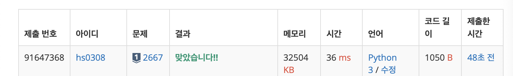

### 오늘의 문제는?
- [16918](https://www.acmicpc.net/problem/16918)
- [2667](https://www.acmicpc.net/problem/2667)
- [13549](https://www.acmicpc.net/problem/13549)

---
### 풀이 시간 

1. 1시간 : 16918 번

<details>
  <summary>내 코드에서 잘못된 점</summary>
  
  네 코드에서 잘못된 부분을 분석해 줄게!  

---

## **1️⃣ `Arr[i][j] == 'O'` → `=` 오타**  
### **🔴 오류 코드 (오타)**  
```python
for i in range(R):
    for j in range(C):
        if Arr[i][j] == 'O':
            Bombq.append((i,j))
        else:
            Arr[i][j] == 'O'  # ❌ 잘못된 코드 (조건문인데 대입을 시도함)
```
### **✅ 수정 코드**  
```python
for i in range(R):
    for j in range(C):
        if Arr[i][j] == 'O':
            Bombq.append((i, j))
        else:
            Arr[i][j] = 'O'  # ✅ 올바르게 대입
```
🚨 **오류 설명:**  
- `Arr[i][j] == 'O'`는 비교 연산자(`==`)인데, 대입을 해야 할 부분에서 `==`를 사용해서 **의미 없는 비교 연산이 되어버림**.  
- `Arr[i][j] = 'O'`로 **대입 연산자(`=`)**를 사용해야 함.

---

## **2️⃣ `bomb()` 함수에서 폭탄을 제거하는 로직이 잘못됨**
### **🔴 오류 코드**  
```python
for x, y in list(Bombq):
    Arr[x][y] = "."
    for i in range(4):
        nx = dx[i] + x
        ny = dy[i] + y 
        if 0 <= nx < R and 0 <= ny < C:
            if Arr[nx][ny] == "O":
                Arr[nx][ny] = "."
```
🚨 **오류 설명:**  
1. `Bombq`를 `list(Bombq)`로 변환해서 **반복문을 돌면서도 `Bombq`를 변경하지 않음**  
   - 하지만 이후에 새 폭탄을 저장하는 로직이 없음 → 즉, 폭발 후 **새로운 폭탄 위치를 기억하지 않음**
2. `Bombq.clear()`로 큐를 초기화하고, 새로운 폭탄 위치를 다시 저장해야 함.

### **✅ 수정 코드**  
```python
# 폭발하는 폭탄 위치를 먼저 저장
explode_positions = set(Bombq)

# 폭발 시킴
for x, y in explode_positions:
    Arr[x][y] = "."
    for i in range(4):
        nx = dx[i] + x
        ny = dy[i] + y
        if 0 <= nx < R and 0 <= ny < C:
            Arr[nx][ny] = "."

# 새로운 폭탄 위치 저장
Bombq.clear()
for i in range(R):
    for j in range(C):
        if Arr[i][j] == "O":
            Bombq.append((i, j))
```
🛠 **수정된 점:**  
✅ **폭발한 위치를 `explode_positions`에 먼저 저장** (기존 큐를 활용)  
✅ **폭발한 후, 새롭게 남아있는 폭탄 위치를 다시 `Bombq`에 저장**  

---

## **3️⃣ 폭탄 설치 과정에서 `Arr[i][j] = 'O'`을 제대로 저장하지 않음**
### **🔴 오류 코드**  
```python
if cnt % 2 == 0:  # 짝수 초라면 폭탄 설치
    for i in range(R):
        for j in range(C):
            if Arr[i][j] == ".":
                print("현재 cnt 값 : ", cnt)
                Bombq.append((i,j))
                Arr[i][j] = 'O'  # ❌ 새로운 폭탄을 설치해야 하는데 저장이 제대로 안 됨
```
🚨 **오류 설명:**  
- `Bombq.append((i,j))`를 하면서도, **이미 'O'가 있는 위치까지 포함됨**
- 모든 빈칸을 **완전히 새로운 폭탄으로 덮어야 함**
- **단순히 빈칸만 확인하지 말고, 전체를 덮어야 함!**  

### **✅ 수정 코드**
```python
if cnt % 2 == 0:  # 짝수 초라면
    for i in range(R):
        for j in range(C):
            Arr[i][j] = 'O'  # ❗ 빈칸 여부와 상관없이 전체를 'O'로 덮어야 함
```
🛠 **수정된 점:**  
✅ **폭탄이 있든 없든 모든 칸을 'O'로 덮도록 변경**

---

## **4️⃣ `while` 루프가 끝까지 실행되지 않음**
### **🔴 오류 코드**  
```python
cnt = 1
while cnt < N:
    print("현재 cnt 값 : ", cnt)
    cnt += 1
```
🚨 **오류 설명:**  
- `cnt`가 증가하면서 **N이 1일 경우 `while` 루프에 아예 안 들어감**  
- 하지만 `N == 1`을 처리하는 부분이 따로 있으므로 괜찮음  
- 문제는 **폭탄이 설치된 이후 폭발 시점에서 올바르게 갱신되지 않음**  

### **✅ 수정 코드**
```python
cnt = 1
while cnt < N:
    cnt += 1
    if cnt % 2 == 0:
        for i in range(R):
            for j in range(C):
                Arr[i][j] = 'O'  # 전체 폭탄 설치
    else:
        simulate()  # 폭탄 폭발 (함수 분리)
```
🛠 **수정된 점:**  
✅ **짝수 초면 전체 폭탄 덮기 → 홀수 초면 `simulate()`로 폭발 처리**  
✅ **로직이 더 깔끔해짐**  

---

## **📌 정리: 네 코드의 주요 오류**
❌ `Arr[i][j] == 'O'`에서 `=`을 사용하지 않음 → **오타 수정 필요**  
❌ `Bombq`에서 폭발 후 새로운 폭탄 위치를 저장하지 않음 → **새로운 큐 갱신 필요**  
❌ 폭탄을 설치할 때 **빈칸이 아닌 모든 칸을 덮어야 함** → **설치 로직 수정**  
❌ `while` 루프 내에서 폭탄을 올바르게 처리하지 않음 → **패턴을 활용해 깔끔하게 개선**  

---

이제 네 코드가 어떻게 개선되었는지 이해했어?  
이제 정답 코드로 바꿔서 **성공적으로 "맞았습니다!" 받을 수 있을 거야!** 😊🔥

</details>

2. 40분정도 2667번 
<details>
  <summary>2667번 성공~!</summary>
  
  - 몰랐던 것 : print("\n".join(map(str, answer)))
    - 이렇게 출력을 해야 하나하나 줄바꿈 해서 주루룩 출력 쉽게 가능 
    - 바보같았던 짓 : 1을 int로 변환했어서.. ==1 로 비교해야하는데 문자열로 비교했음
    - 

</details>