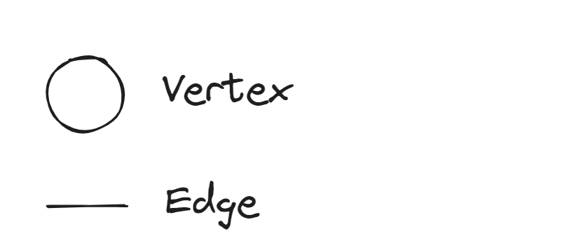
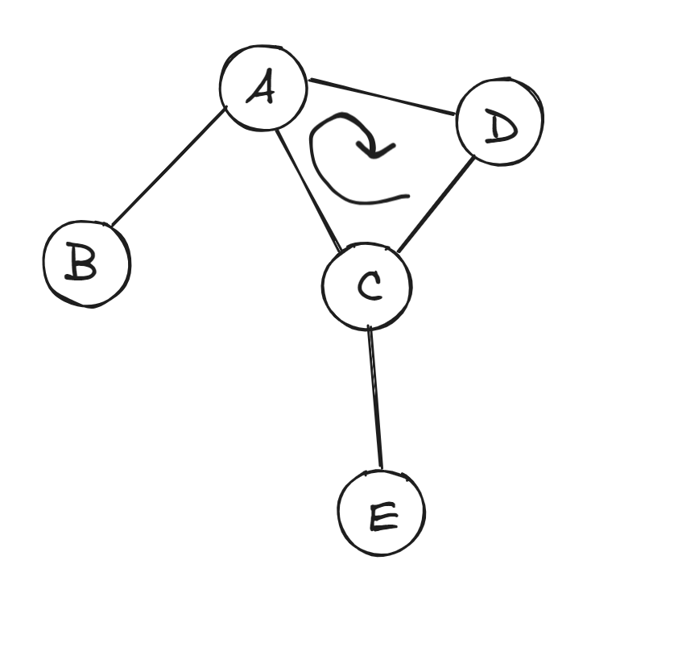
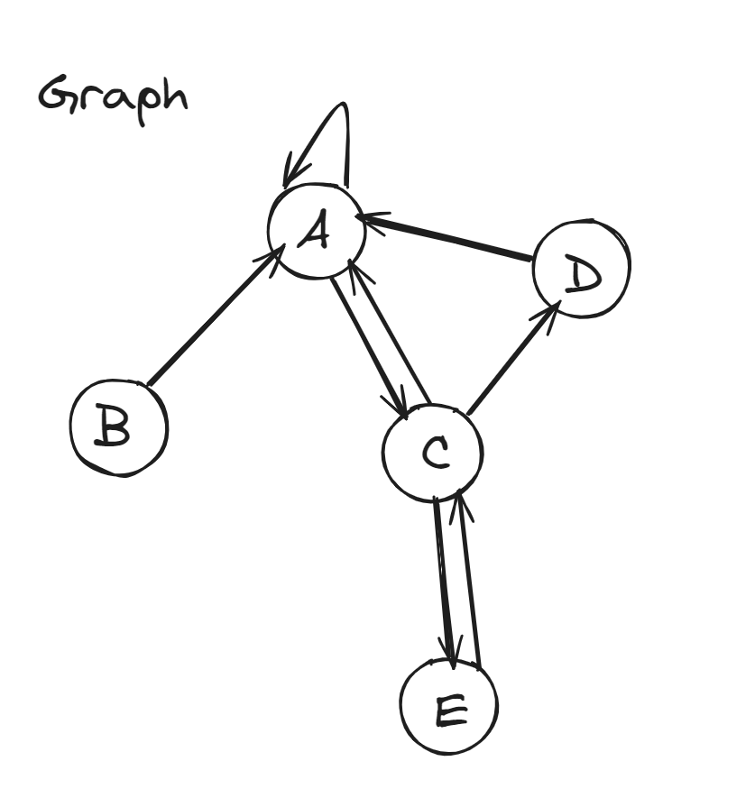
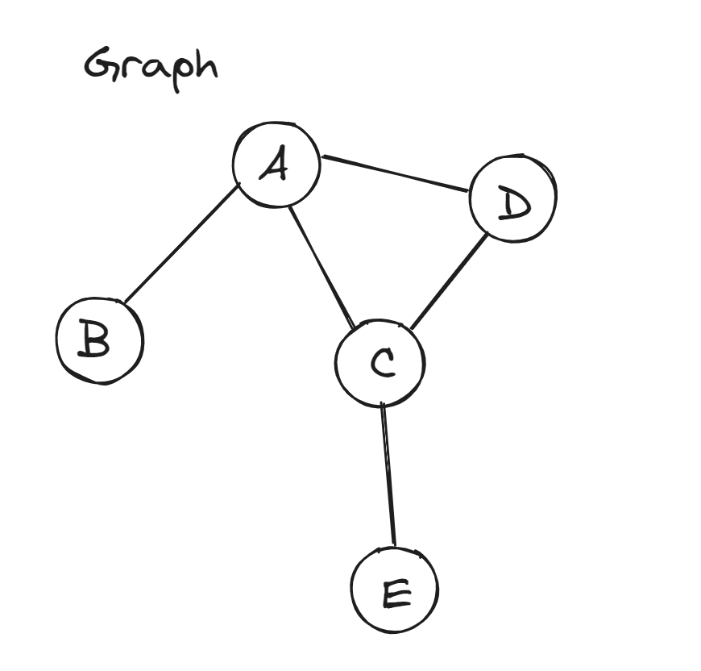
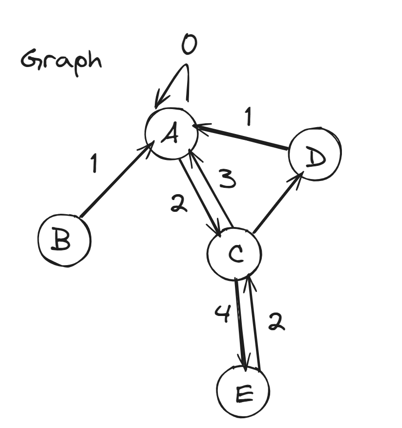
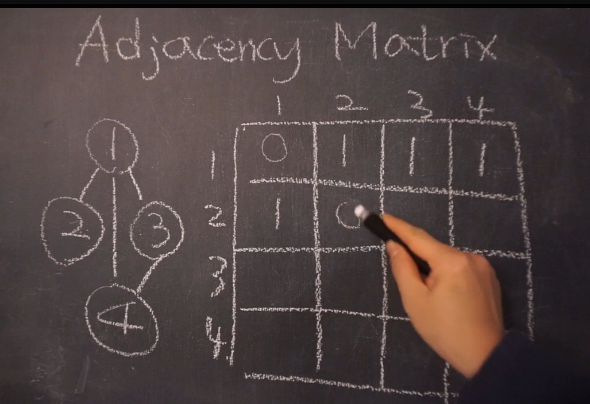
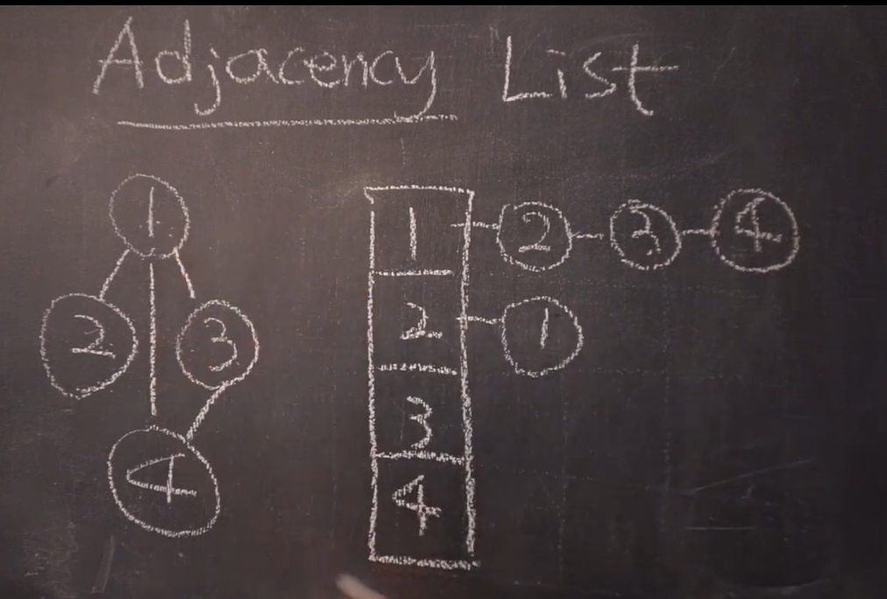

## 그래프란

그래프는 Vertex 와 Edge 로 이루어져 있다. 

- 트리는 그래프의 한 형태이다. 사이클이 없고 아래로만 흐르는 방향 그래프이다.

### **그래프의 특성**

- **방향이 있는 그래프**
  - Cyclic : 하나 이상의 Circle 을 만드는 경우가 있고
    
  - ACyclic : 아닌 경우가 있다. 
  
- 방향이 없는 그래프 : ex ) 트리
  - Undirected Graph
  
- weighted 그래프 : 가중치
  
  
### 그래프를 표현하는 방법

- Adjacency Matrix (인접 행렬)
  : 2차원 배열에 표현
   
  그래프를 표에 나타냄
  
- Adjacency List
  : linked list 로 표현하는 방법
   
  배열에 모든 노드를 집어 넣고 각 배열에 있는 해당 노드와 인접한 노드들을 연결리스트로 나열해서 저장하는 것이다.
  

  
### DAG (Directed Acyclic Graph)
- 이런게 있다.

### 어떻게 그래프를 표현할 수 있을까?
트리에서 노드를 만들어왔던 것처럼
각vertax 안에 value 를 저장해주면된다.
그 링크는 array, hashmap 형태를 가지면된다.

## DFS, BFS 

### DFS
- recursion - call stack 
- iteration - stack

DFS 와 BFS 는 문제 풀고 나중에 마저 적겠어요. (이러니까 못풀지)