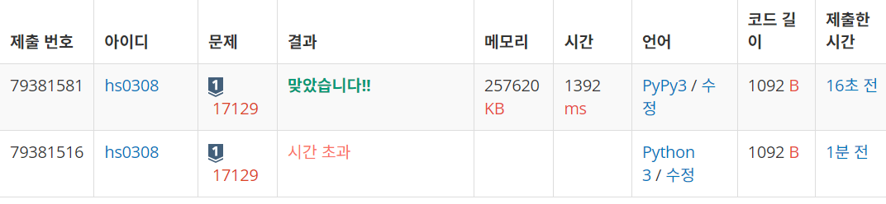
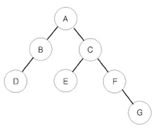
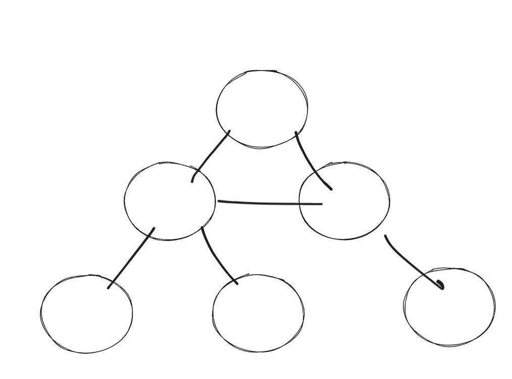
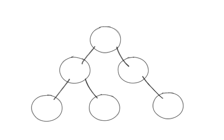

# 17129
정보섬 2층 : A(nxm)  
A(i,j) : 0 이면 빈 복도  
A(i,j) : 1 이면 장애물 
딱따구리 : 2 
청국장 : 3 
스시 : 4 
맥앤치즈 : 5 

단위시간마다 한칸, 상하좌우 움직이기 가능 
2,3,4,5 는 장애물이 아니므로 지나갈 수 있음. 

시작점 : 2의 위치 
가장 가까운 음식에 도착해야 함 

---

- arr 을 입력받을 때 값이 2라면 위치를 저장해둔다.
- 그 위치부터 배열을 탐색해야지
- dfs 로 ..?
- 아 머리야
- bfs 로 해야대 : 이유는 바로, 이곳저곳 방문하기 때문ㅇ..
- 방향 배열을 이용해서 확인하고, 방문배열 이용해서 탐색하는건 알겠는데 구체적으로 완벽하게 코드를 모르겠어
- bfs 구현법을 잘 모르기 때문이였다. bfs 는 deque 를 쓴다. 기억하자.

근데 이거 왜 pypy3 으로는 시간초과가 안나쥐 ? 

# 1991
_어우 왜이렇게 하기 싫지..._

오우... 
학교 과제같다...
안되겠다. 도와줘요 동빈나!

링크 [참조](https://www.youtube.com/watch?v=i5yHkP1jQmo)

# 14675
단절점과 단절선

- 단절점(cut vertex) : 해당 정점을 제거하였을 때, 그 정점이 포함된 그래프가 2개 이상으로 나뉘는 경우, 이 정점을 단절점이라 한다.
- 단절선(bridge) : 해당 간선을 제거하였을 때, 그 간선이 포함된 그래프가 2개 이상으로 나뉘는 경우, 이 간선을 단절선이라 한다.

#### 단절점과 단절선인지를 어떻게 아느냐?
추측 : 2개 이상의 그래프가 되려면
최소 2개이상의 정점이 단절점을 기준으로 양쪽에 있어야 하고,, 연결되어있음 안됨 
단절선 같은경우, 그래프가 연결되어있으면 안될 것 같다.

대충 찾아보니 이분 그래프? 의 개념을 응용해야할 것 같다.
아닌가...
아닌것 같다. 

- 단절선 
내가 좀 잘못생각한게, '트리' 라는 사실을 간과 하고 

이런 경우를 생각했다 ㅋㅋㅋ...

때문에, 모든 간선은 단절선이다. 트리에서는
그래서 다 yes 임 

- 그렇다면 단절점은?
  - 리프노드일 때 : 단절점 x
  - 자식이 하나인 노드 : 단절점 x
  그래가지고.. 정점 하나에 연결된 자식노드가 두개인지를 판단하면된다.

솔직고백 : 너무 어렵게 생각해서(막 bfs,dfs 돌아야되나 생각함)... 블로그 봤다. ([참고](https://imzzan.tistory.com/43))

