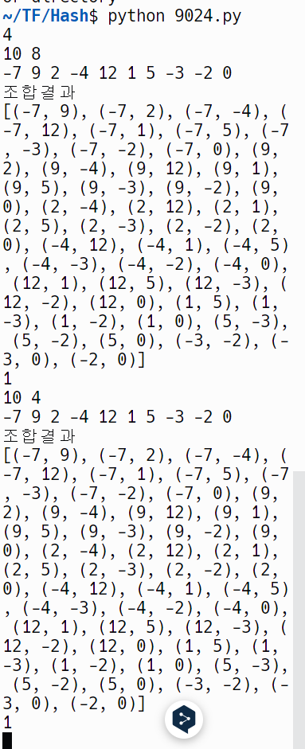

## 주절주절 기록 
### 9024
arr S, 정수 K 
S에 속하는 서로 다른 두개의 정수의 합이 K 에 가장 가까운 두 정수

answer = 두 정수의 조합의 개수를 계산

t
n , k 
이때 n 은 arr 의 길이, k 는 k 
출력은 바로

1 7 3 5 중에 20과 가까운 수를 구하려면?

근데 파이썬에 조합 라이브러리 있지않나

k 에 가까운것의 기준이 뭐지 ?
왜 20인데 7,5 가 가깝지.. 매우 먼듯 싶은데.. 8이나 차이나는데..
아 배열중에서 그나마 '가장' 가까운것이 기준이라 그렇겠군


반복문 돌면서
두 수의 합이 | 이전의 합 - k | 보다 | 두수의 합 - k | 이 적다면, answer를 초기화 하고, answer +=1 을 새롭게 해준다. 같다면, 초기화 없이 그냥 +1 
이렇게 하는게 맞나..

이렇게 하면 k 값에 상관없이 이전 값보다 크거나 같을때만 찾아버리나? 


난 이게 최선이다... 


### 19583

입장의 기준
- 시작 1시간 전에 대화
- 개총 시작하자마자 채팅

퇴장의 기준
- 개총 끝
- 개총 스트리밍 끝

예외)
00:00 -> 개총 시작 전 대기시간
스트리밍 이후 채팅 기록 -> 다른 스트리밍 영상의 채팅 기록 

개총 시작 시간 : S
개총 끝낸 시간 : E
개총 스트리밍을 끝낸 시간 : Q
(00:00 ≤ S < E < Q ≤ 23:59)

S로부터 1시간 전 까지만 입장 ㅇㅈ
E 부터 Q까지 퇴장 인정 
입장, 퇴장 둘다 모두 인정이 되어야만 출석 인정

일단 해시인건 알겠어
근데 입력을 그만 받는건 어케하지?
 

**사용자 입력 리스트 처리하기**

사용자 입력을 리스트에 저장하다가, 특정 조건(예: 빈 문자열 입력)이 만족되면 입력 받는 것을 중단할 수 있습니다.

예제 코드
```
python


user_inputs = []
while True:
    user_input = input("Enter a value (or press Enter to stop): ")
    if not user_input:
        print("Exiting input loop...")
        break
    user_inputs.append(user_input)

print("User inputs:", user_inputs)

```

시간 비교를 어떻게 하지?
2100 2000 2330 어쨌든 : 를 제외하고 보면 숫자로 비교가 가능하니까
숫자로 변환을 해준다.
어떻게?

문자열을 슬라이싱 하고 합해서 int 로 바꿔준다.
11:00 이면
int(s[:2] + s[3:])